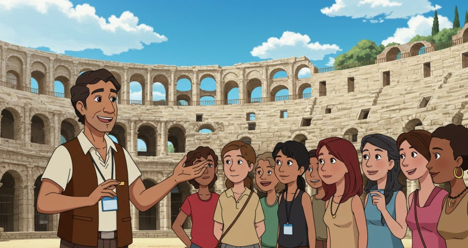
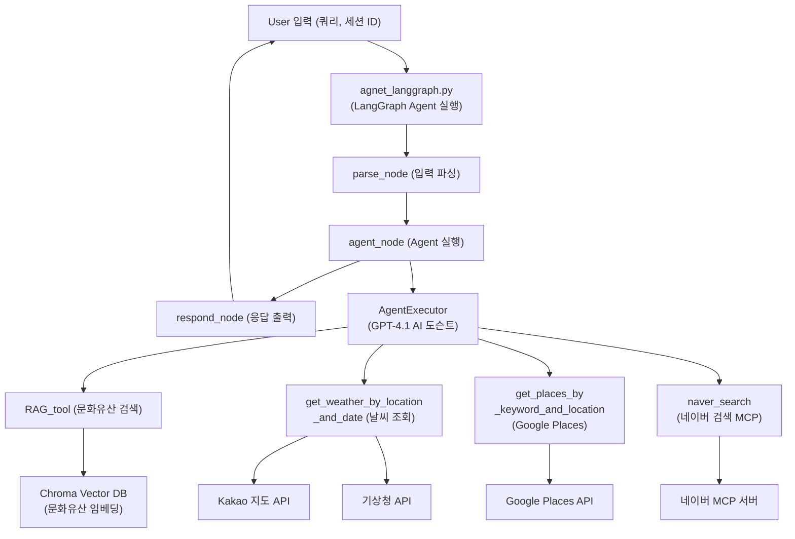
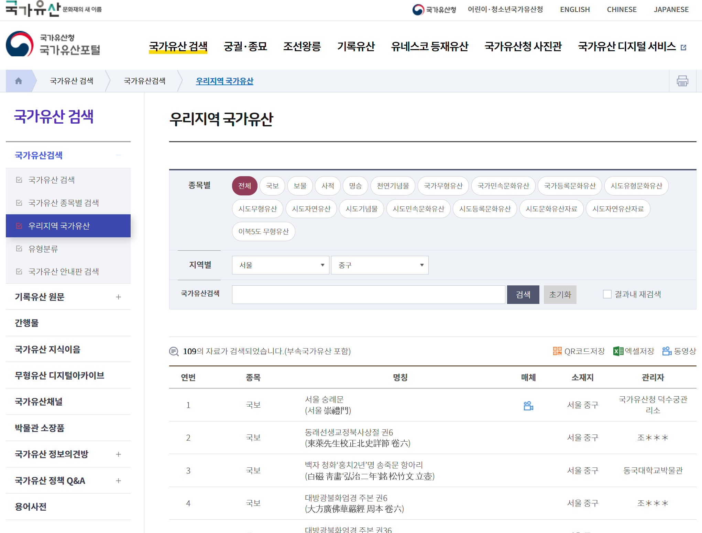
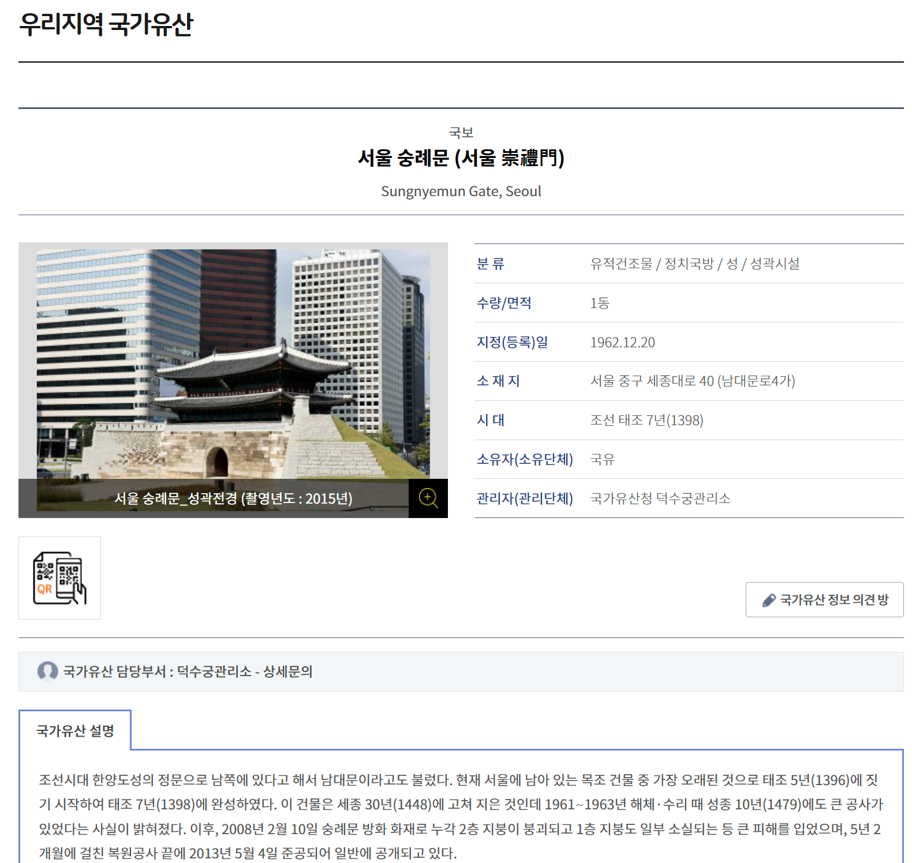
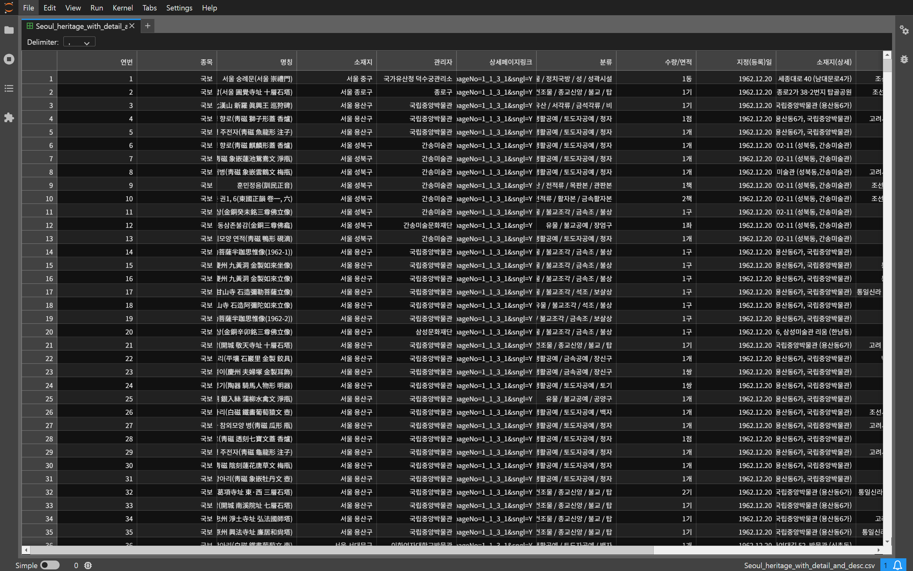
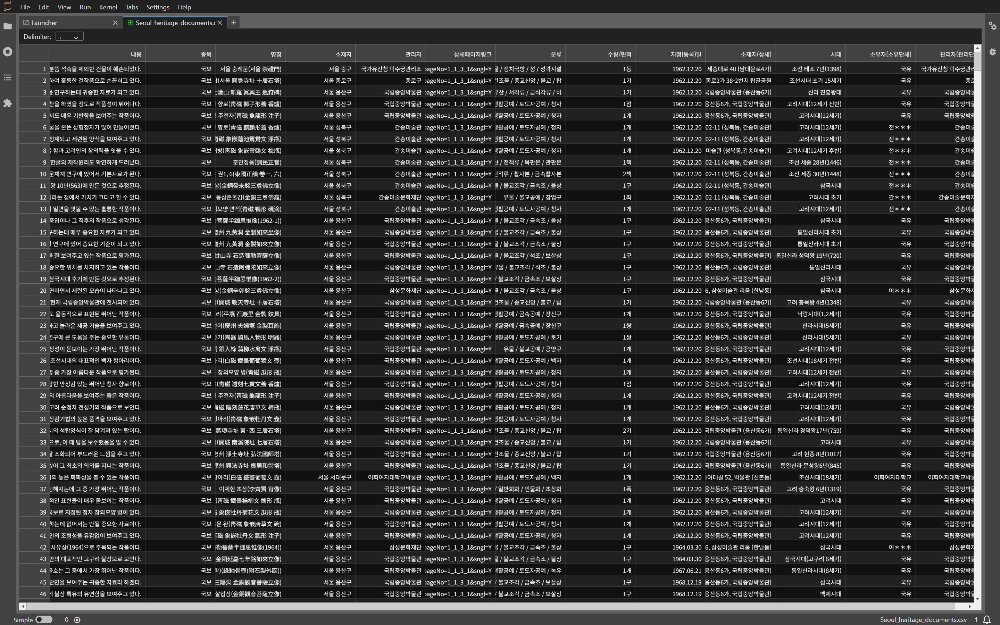
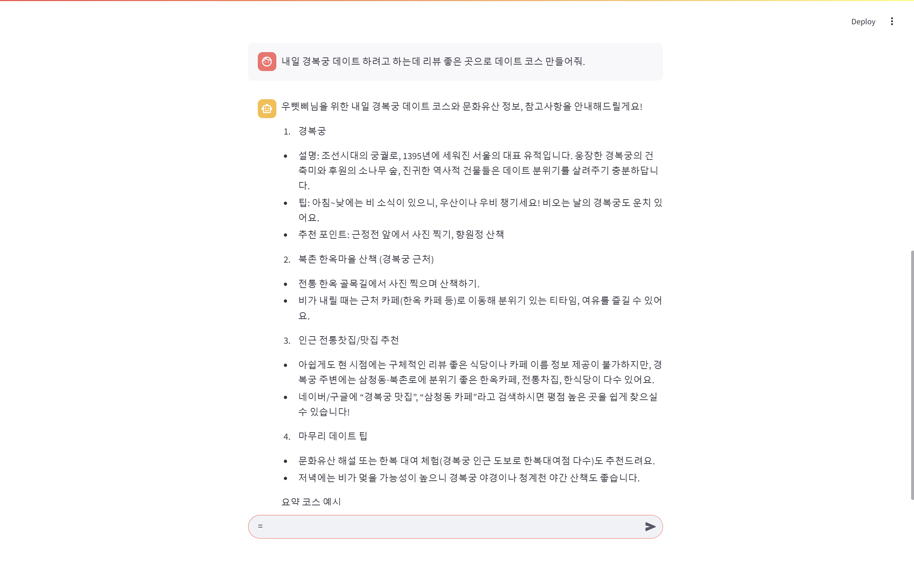

###### SKN13_3rd_5TEAM
# 주제 : RAG, API, MCP을 이용한 문화유산 여행 코스 추천 모델


## 📖 프로젝트 소개  
📚 여행나래는 사용자의 질문에 문화유산 정보를 설명하고, 날짜·날씨·위치에 따라 맞춤형 여행 코스를 추천해주는 LLM 기반 대화형 도슨트 챗봇입니다.
해설가 없이도 문화유산을 쉽고 즐겁게 탐방할 수 있도록 돕습니다.


# 🏷️ 목 차
1️⃣ [팀 소개](#1️⃣-팀-소개)

2️⃣ [프로젝트 개요](#2️⃣-프로젝트-개요)

3️⃣ [기술 스택](#3️⃣-기술-스택)

4️⃣ [시스템 아키텍처](#4️⃣-시스템-아키텍처)

5️⃣ [업무 분류 체계](#5️⃣-업무-분류-체계)

6️⃣ [요구사항 명세서](#6️⃣-요구사항-명세서)

7️⃣ [수집한 데이터 및 전처리 요약](#7️⃣-수집한-데이터-및-전처리-요약)

8️⃣ [테스트 계획 및 결과 보고서](#8️⃣-테스트-계획-및-결과-보고서)

9️⃣ [성능 개선 노력](#9️⃣-성능-개선-노력) 

🔟 [추후 개선점](#-추후-개선점)

🔍 [한 줄 회고](#-한-줄-회고) 


## 1️⃣ 팀 소개
 ### 팀 명 : 여행 나래
### 🗓️ 개발 기간
> 2025.06.27 ~ 2025.06.30
### 👥 팀원

<table width="100%">
  <tr>
    <td align="center" width="25%">
      
    </td>
    <td align="center" width="25%">
      
    </td>
    <td align="center" width="25%">
      
    </td>
    <td align="center" width="25%">
      
    </td>
  <tr>

  <tr>
    <td align="center" width="25%">
      <b>우삣삐</b>
    </td>
    <td align="center" width="25%">
      <b>박삣삐</b>
    </td>
    <td align="center" width="25%">
      <b>승삣삐</b>
    </td>
    <td align="center" width="25%">
      <b>민삣삐</b>
    </td>
  </tr>

  <tr>
    <td align="center" width="25%">
      <a href="https://github.com/WooZhoon">
        
      </a>
    </td>
    <td align="center" width="25%">
      <a href="https://github.com/subin0821">
        
      </a>
    </td>
    <td align="center" width="25%">
      <a href="https://github.com/qqqppma">
        
      </a>
    </td>
    <td align="center" width="25%">
      <a href="https://github.com/Gogimin">
        
      </a>
    </td>
  </tr>
</table>

## 2️⃣ 프로젝트 개요
### ⭐ 프로젝트 필요성

📌 1. **문화유산 정보의 실용성 부족**

기존 문화유산 정보는 주로 정적인 설명이나 위치 안내에 머무르며,현장에서 궁금한 점이 생겨도 도슨트처럼 즉각적으로 안내해주는 서비스가 부족합니다.  
특히, 문화유산 주변의 생활 정보(맛집, 카페, 이동 동선 등)와 연계된 안내가 거의 없어 현장 경험이 단조롭고, 문화유산이 일상과 자연스럽게 연결되지 못하는 한계가 있습니다.

📌 2. **여행 및 데이트 코스 설계의 복잡함**  

여행이나 데이트를 계획할 때, 날씨, 교통, 시간대, 동선, 주변 상권 등 다양한 변수를 한 번에 고려해야 하므로 사용자가 직접 정보를 수집하고 조합하는 데 많은 시간과 노력이 필요합니다.  
각각의 정보가 여러 플랫폼에 흩어져 있어 효율적으로 코스를 설계하기 어렵고, 맞춤형으로 안내해주는 서비스가 없어 만족스러운 경험을 얻기 힘든 실정입니다.

🎯 **"AI 도슨트가 내 일정과 취향을 반영해 코스를 짜준다면?"** 

자연어로 간단히 질문만 해도, AI 도슨트가 실시간 날씨와 위치, 시간대, 주변 정보를 종합적으로 분석해 개인 맞춤형 문화유산 중심의 데이트·여행 코스를 추천해줍니다.

이로써 문화유산은 더 이상 어렵고 먼 존재가 아니라, 내 일상과 취향에 맞춰 도슨트처럼 친절하게 안내받으며 쉽게 즐길 수 있는 생활 속 경험이 됩니다.

> 대화형 AI **여행나래**🤖는  
**도슨트의 전문성**과 **여행 가이드의 실용성**을 결합해 문화유산 탐방을 더욱 쉽고 풍요롭게 만들어주는 새로운 라이프스타일 플랫폼입니다.


### 🎯 프로젝트 목표

1. **AI 도슨트 기반의 맞춤형 안내 제공**  
   사용자의 위치, 날짜, 날씨, 관심사 등 다양한 정보를 종합적으로 분석하여 전문 도슨트처럼 문화유산과 주변 명소(맛집, 카페 등)를 연결한 개인 맞춤형 데이트·여행 코스를 추천합니다.

2. **문화유산 정보의 생활 속 활용 확대**  
   문화유산을 단순한 관람 대상이 아닌, 일상 속에서 자연스럽게 경험하고 즐길 수 있는 실질적이고 실용적인 정보로 재구성합니다.

3. **사용자 중심의 대화형 인터페이스 구현**  
   누구나 자연어로 쉽게 질문하고, 도슨트 AI가 즉각적이고 친절하게 응답하는 대화형 서비스 환경을 제공합니다.
   
5. **지역 경제 및 문화 활성화 기여**  
   문화유산과 지역 상권(식당, 카페 등)을 연계하여 방문객의 체류 시간과 만족도를 높이고, 지역 경제와 문화 활성화에 기여합니다.

6. **새로운 문화유산 경험의 표준 제시**  
   기술과 도슨트를 결합한 새로운 탐방 경험을 통해 문화유산 활용의 혁신적 모델을 제시하고, 다양한 분야로의 확장 가능성을 모색합니다.


<hr>

## 3️⃣ 기술 스택 및 파일 구조조
| 항목                | 내용 |
|---------------------|------|
| **Language**        |  |
| **Development**     |  |
| **Crawler**         | <br> |
| **Embedding**       |  |
| **LLM Model**       |  |
| **Collaboration Tool** |  |
| **Vector DB**|  |
| **API 활용** |    |

<hr>

```markdown
SKN13-3rd-5Team/
├── agent/ # 에이전트 관련 실행 파일 및 메인 로직 포함
│   ├── agent_AgentExecutor.py 
│   ├── agent_langgraph.py
│   └── app.py
│
├── dataset/ # CSV 데이터 및 데이터 로더 스크립트 포함
│   ├── Busan_heritage_with_detail_and_desc.csv
│   ├── Chungbuk_heritage_with_detail_and_desc.csv
│   ├── Chungnam_heritage_with_detail_and_desc.csv
│   ├── Daegu_heritage_with_detail_and_desc.csv
│   ├── Daejeon_heritage_with_detail_and_desc.csv
│   ├── Gangwon_heritage_with_detail_and_desc.csv
│   ├── Gawngju_heritage_with_detail_and_desc.csv
│   ├── Gyeongbuk_heritage_with_detail_and_desc.csv
│   ├── Gyeonggi_heritage_with_detail_and_desc.csv
│   ├── Gyeongnam_heritage_with_detail_and_desc.csv
│   ├── Incheon_heritage_with_detail_and_desc.csv
│   ├── Jeju_heritage_with_detail_and_desc.csv
│   ├── Jeonbuk_heritage_with_detail_and_desc.csv
│   ├── Jeonnam_heritage_with_detail_and_desc.csv
│   ├── Sejong_heritage_with_detail_and_desc.csv
│   ├── Seoul_heritage_with_detail_and_desc.csv
│   ├── Ulsan_heritage_with_detail_and_desc.csv
│   └── csv_loader.py
│
├── image/  # 프로젝트 관련 이미지 및 팀원 사진 저장 폴더
│   ├── 국가유산포털.png
│   ├── 김승호_사진.png
│   ├── 김지민_사진.png
│   ├── 박수빈_사진.png
│   ├── 서울숭례문_예시.png
│   ├── 우지훈_사진.png
│   ├── CSV_예시.png
│   └── IMG_9470.jpeg
│
├── llm_tools/ # LLM 연동 도구 및 API 호출 모듈 포함
│   ├── chat_history_manager.py
│   ├── chat_history_manager2.py
│   ├── get_weather.py
│   ├── google_places.py
│   ├── naver_search.py
│   └── retriever.py
│
├── notebook/ # Jupyter 노트북 및 실험용 스크립트 저장 폴더
│   ├── 날씨조회_API.ipynb
│   ├── 크롤링_우지훈.ipynb
│   ├── crawling_heritage.py
│   ├── langgraph.ipynb
│   ├── test_csv_loader.ipynb
│   └── test_retriever.ipynb
├── .env # 환경 변수 및 API 키 관리 파일
├── .gitignore # Git 버전 관리에서 제외할 파일 및 폴더 목록
├── app.py
├── CONTRIBUTING.md # 프로젝트 기여 가이드 문서
└── README.md # 프로젝트 소개 및 문서화 파일
```
<hr>

## 4️⃣ 시스템 아키텍처



**데이터코스 추천 챗봇 동작 단계**
1. 질문 입력
→사용자가 관심사, 목표, 일정, 위치 등 원하는 조건을 자연어로 입력합니다.

2. 외부 정보 검색 및 수집
→챗봇(Agent)은 사용자의 질문을 분석하여 문화유산 정보(RAG_tool, Chroma DB), 날씨 정보(get_weather_by_location_and_date), 주변 장소 정보(get_places_by_keyword_and_location, naver_search) 등 다양한 외부 데이터 소스와 API를 실시간으로 호출해 필요한 정보를 수집합니다.

3. 프롬프트 구성 및 LLM 호출
→수집된 정보와 사용자 입력을 바탕으로 LLM(GPT-4.1 등)에 전달할 프롬프트를 동적으로 구성하여, 가장 적합한 맞춤형 코스 추천 답변을 생성하도록 합니다.

4. 맞춤형 답변 반환
→LLM이 생성한 결과(데이트코스, 동선, 설명 등)를 사용자가 이해하기 쉽게 정리하여 대화형으로 제공합니다.

<hr>

## 5️⃣ 업무 분류 체계

| 작업 명             | 시작일 | 종료일 | 담당자                | 산출물                 | 의존 작업  |
|--------------------|:------:|:------:|-----------------------|-----------------------|------------|
| 프로젝트 주제 선정    | 06-25   | 06-27 | ALL                   | 없음                  | 없음        |
| 크롤링               | 06-27   | 06-30 | 김지민, 우지훈         | CSV                   | 프로젝트 주제 선정|
| API 찾기             | 06-27   | 06-30 | 박수빈, 우지훈         | 날씨정보API, 위치정보API|프로젝트 주제 선정|
| 데이터 - DB 연동     | 06-27   | 06-30 | 김승호, 우지훈          | Chroma_db            | 크롤링, API 찾기|
| 코드 취합            | 06-27   | 06-30 | 김승호 ,우지훈          | 없음                  |크롤링, API 찾기, <br> 데이터 - DB 연동, <br> Streamlit 화면구현|
| Streamlit 화면 설계  | 06-27   | 06-30 | 박수빈                 | 설계파일 WEB 화면     |프로젝트 주제 선정|
| Streamlit 화면 구현  | 06-27   | 06-30 | 김승호, 박수빈         | Streamlit 화면         |Streamlit 화면 설계|
| README.md 작성       | 06-27   | 06-30 | 김지민, 박수빈        | GitHub README.md      |코드 취합, 최종 점검|
| 최종 점검            | 06-27   | 06-30 | ALL                   | 없음                  |모든 작업|

<hr>

## 6️⃣ 요구사항 명세서
| **대분류**           | **구현 기능**     | **요구사항 요약**                                                   | **설명 및 적용 기술**                                          |
|----------------------|------------------|---------------------------------------------------------------------|---------------------------------------------------------------|
| **사용자 인터페이스** | 질문 입력 기능    | 사용자가 자연어로 다양한 주제(문화유산, 데이트코스, 여행, 날씨 등)를 입력 가능해야 함 | Streamlit에서 텍스트 입력 UI로 구현 완료                      |
| **사용자 인터페이스** | 답변 출력 기능    | GPT가 도출한 답변이 단락 형태로 자연스럽게 출력되어야 함            | Streamlit에서 응답 창 구성, 즉시 출력 지원                     |
| **검색 기능**         | 문화유산 검색 기능 | 입력된 키워드를 기반으로 관련 문화유산 설명을 찾아야 함              | Chroma 벡터DB + RAG 조합 사용                                 |
| **검색 기능**         | 장소 검색 기능    | 문화유산 근처의 실제 장소(카페, 맛집 등) 검색 가능해야 함           | Google Places API 및 네이버 Local/MCP API 연동 예정            |
| **벡터 DB**           | 벡터 DB 구성      | 문화유산 데이터를 벡터화하여 저장하고 검색할 수 있어야 함           | Chroma 사용하여 Vector DB 구성 완료                            |
| **LLM 응답**          | Prompt 구성       | 어떤 툴을 어떤 상황에서 사용할지를 system prompt 등에 명확하게 지정 | Langchain `ChatPromptTemplate` 사용하여 역할 기반 프롬프트 구성 |
| **LLM 응답**          | 자연어 응답 생성  | GPT-4.1 모델이 자연스럽고 대화형 스타일로 답변 제공                | AgentExecutor 기반 실행. 챗봇 스타일 및 데이트코스 포함         |
| **시스템 제어**       | 기능 분기 처리    | 질문이 어떤 유형인지 분석하여 적절한 도구(RAG, 날씨, 장소 등) 호출해야 함 | 키워드 기반 판단 또는 GPT 기반 tool-selector 적용              |
| **시스템 제어**       | 멀티턴 대응       | 대화의 흐름이 끊기지 않도록 이전 맥락을 기억하며 연속적인 응답을 가능하게 해야 함 | `RunnableWithMessageHistory`와 LangGraph 기반으로 세션 상태 관리 |

<hr>

## 7️⃣ 수집한 데이터 및 전처리 요약

> 본 시스템은 문화유산 정보를 기반으로 한 RAG(Retrieval-Augmented Generation) 방식의 검색 응답을 제공하기 위해 다음과 같은 전처리 과정을 거칩니다.

1. **데이터 수집**

   국내 문화유산 관련 정보를 크롤링하여 CSV 형식으로 수집

   
   [국가유산포털](https://www.heritage.go.kr/heri/cul/culSelectRegionList.do?s_ctcd=11&ccbaLcto=12&pageNo=1_1_3_1)에서 문화재 및 유적지 관련 데이터를 크롤링하였습니다.
   
  


<br>
<br>

```python
def crawl_heritage_data():
    base_url = "https://www.heritage.go.kr"
    url_template = (url_template)
    header = ['연번', '종목', '명칭', '소재지', '관리자', '상세페이지링크']
    all_data = []

    for page in range(1, page):
        url = url_template.format(page=page)
        res = requests.get(url)
        soup = BeautifulSoup(res.text, "html.parser")
        for row in soup.select("#txt > table > tbody > tr"):
            tds = row.find_all('td')
            if len(tds) < 6:
                continue
            num = tds[0].get_text(strip=True)
            category = tds[1].get_text(strip=True)
            name = tds[2].get_text(strip=True)
            location = tds[4].get_text(strip=True)
            manager = tds[5].get_text(strip=True)
            a_tag = tds[2].find('a')
            link = urllib.parse.urljoin(base_url, a_tag['href']) if a_tag and a_tag.has_attr("href") else ''
            all_data.append([num, category, name, location, manager, link])
        time.sleep(0.5)
```


### 코드 주요 변수 및 동작 설명

- **base_url**  
  상세페이지 링크를 만들 때 기준이 되는 사이트 주소입니다.

- **url_template**  
  각 페이지별로 접근할 수 있는 URL 형식입니다.  
  (예시: `"https://www.heritage.go.kr/heri/cul/culSelectRegionList.do?culPageNo={page}&region=2"`)

- **header**  
  CSV 파일의 첫 번째 줄에 들어갈 컬럼명 리스트입니다.

- **all_data**  
  긁어온 모든 데이터를 저장할 빈 리스트입니다.

- **num**  
  연번(번호)

- **category**  
  종목(문화재 종류)

- **name**  
  명칭(문화재 이름)

- **location**  
  소재지(위치)

- **manager**  
  관리자(관리 기관)

- **반복 동작 설명**  
  1페이지부터 마지막 페이지까지 반복하면서,
  각 페이지의 표에서 한 줄씩 원하는 정보를 뽑아 리스트에 저장합니다.

- **time.sleep(0.5)**  
  너무 빠른 요청으로 서버에 부담을 주지 않도록,  
  각 페이지마다 0.5초씩 잠깐 쉬어줍니다.



2. **문서화(Document화)**

   각 문화유산 정보를 LangChain의 Document 객체로 변환하여, 텍스트 검색이 가능하도록 구성

   특히, 명칭, 종목, 시대, 설명, 소재지 등의 핵심 필드를 통합하여 정보의 일관성과 검색 가능성 강화
   
 

3. **벡터 임베딩 및 저장소 구축**

   OpenAI의 text-embedding-3-large 모델을 사용하여 각 문서에 대한 임베딩을 수행

   벡터 임베딩은 Chroma 벡터 DB에 저장되며, 이후 유사도 기반 검색에 활용

4. **검색 및 RAG Tool 연동**

   사용자 질문이 들어오면, 관련 벡터를 검색해 설명 내용을 추출하고, 이를 기반으로 LLM이 최종 응답을 생성

<hr>

## 8️⃣ 테스트 계획 및 결과 보고서
### 테스트 계획 및 결과 보고서

### ✅ 테스트 개요

- **테스트 목적**  
  AI 도슨트 기반 데이트코스 추천 챗봇의 주요 기능(문화유산 정보 안내, 실시간 날씨·장소 추천, 맞춤형 코스 설계)이 정상적으로 작동하는지 확인하고, 사용자 경험을 향상시키기 위한 개선점을 도출한다.

- **테스트 기간**  
  2025년 6월 29일 ~ 2025년 7월 1일

- **테스트 환경**  
  - LLM: GPT-4.1 (OpenAI API)  
  - 벡터 DB: Chroma (문화유산 임베딩)  
  - 외부 API: 기상청, Kakao 지도, Google Places, 네이버 MCP  
  - 인터페이스: CLI/웹 챗봇

  - **테스트 화면 구현**
  

  

  
  

### ✅ 테스트 항목 및 시나리오

| 테스트 항목           | 시나리오 설명                                                         | 기대 결과                                             |
|---------------------|---------------------------------------------------------------------|-----------------------------------------------------|
| 문화유산 정보 안내     | 사용자가 특정 지역의 문화유산 정보를 질문                            | 정확하고 풍부한 문화유산 설명 제공                   |
| 날씨 정보 제공        | 사용자가 날짜/지역을 지정해 날씨를 문의                              | 실시간·정확한 날씨 요약 정보 제공                    |
| 주변 장소 추천        | 사용자가 문화유산 인근 맛집, 카페 등 장소 추천 요청                  | 실제 존재하는 장소(5개 내외)와 평점, 주소 안내        |
| 맞춤형 데이트코스 설계 | 사용자가 조건(날씨, 시간, 관심사 등)에 맞는 데이트코스 추천 요청      | 시간대별 동선이 포함된 최적의 코스 제안               |
| 예외/오류 처리        | 잘못된 입력, 존재하지 않는 지역/장소, API 오류 등 발생 시              | 적절한 오류 메시지 또는 대체 안내 제공                |
| 응답 시간             | 사용자의 질문에 대한 응답 시간 측정                                   | 10초 이내에 응답 제공                                 |
| 데이터 연동           | 외부 API 및 DB에서 정보가 정확히 조회·활용되는지 확인                | 최신 정보 기반의 정확한 답변 제공                    |

### ✅ 테스트 결과 요약

| 테스트 항목           | 결과      | 비고                                            |
|---------------------|---------|-----------------------------------------------|
| 문화유산 정보 안내     | 성공      | 대부분의 문화유산에 대해 정확한 설명 제공             |
| 날씨 정보 제공        | 성공      | 실시간 API 연동, 지역별·시간별 날씨 정확히 안내        |
| 주변 장소 추천        | 부분 성공 | 일부 지역에서 장소 정보 부족, 평점·주소 누락 사례 있음   |
| 맞춤형 데이트코스 설계 | 성공      | 조건(날씨, 시간, 동선 등) 반영한 코스 제안             |
| 예외/오류 처리        | 성공      | 잘못된 입력, 미지원 지역에 대해 적절한 안내 제공        |
| 응답 시간             | 부분 성공      | 평균 15초로 기준 미달                              |
| 데이터 연동           | 성공      | 모든 외부 API 및 DB 연동 정상 작동                    |

<hr>

## 9️⃣ 성능 개선 노력
- **Chroma 벡터 데이터베이스 도입**

 대규모 문서 검색 효율을 개선하고 의미 기반 정보 검색을 가능하게 하기 위해, 벡터 임베딩 기반의 Chroma DB를 구성하여 응답 정확도와 속도 모두를 향상시킴
 
- **정확도 향상을 위한 API 연동**

 초기 모델은 API 연동 없이 모델 연동만으로 인한 할루시네이션 현상 발생, 이를 해결하기 위해 Google Place API,Naver Search를 연동하여 보다 정확한 정보를 제공함

<hr>

## 🔟 추후 개선점
- **정확한 정보 제공**

 Google Place API, Naver search를 활용했음에도 불구하고 아직 남아있는 할루시네이션 오류 해결 예정
 
- **AI 음성 도슨트 도입**

 유적지 정보와 추천 코스를 AI 목소리로 안내하는 음성 도슨트 기능을 추가하여, 시각 중심의 인터페이스에서 벗어나 보다 몰입감 있고 접근성 높은 사용자 경험을 제공할 예정

- **데이터베이스 확장**

 보다 폭넓은 질의응답을 지원하기 위해 다양한 출처의 정보를 통합하고, 지속적인 데이터 수집을 통해 지식 기반의 범위를 확장 예정

- **응답 속도 개선**
 
 평균 15초 수준이던 챗봇 응답 지연 문제를 해결하기 위해, GPT 호출 최적화, 불필요한 히스토리 요약, 벡터 DB 검색 범위 축소 및 외부 API 호출 캐싱 등 다양한 성능 개선 기법을 적용 예정

- **대화 내용 목록화 및 페이지 분할 도입**
 
 현재 대화는 모든 메시지가 한 화면에 누적되어 표시되는 구조로, 대화가 길어질수록 UI가 복잡해지고 사용성이 떨어짐, 이에 따라 기존 대화를 목록 형태 또는 접기/펼치기 구조로 개선하고, 필요 시 페이징(페이지 단위) 기능을 도입하여 대화 가독성을 향상시킬 예정

- **세션 단위 분리 구조 도입 (새로고침 시 새 창 생성)**
 
 사용자가 페이지를 새로고침(F5)하면 새로운 대화 세션이 시작되도록 설계하여, 기존 대화와 분리된 독립된 대화를 진행할 수 있도록 개선할 예정

- **과거 대화 기록 열람 기능 추가 예정**

 추후에는 사용자가 대화 내역을 목록으로 열람하고, 특정 세션을 선택하여 이어서 대화하거나 복기할 수 있는 기능도 구현할 예정

<hr>

## 🔍 한 줄 회고

| 팀원   | 한 줄 회고 내용 |
|--------|----------------|
| 우삣삐 | 랭체인이라는 걸 배우기 전에 개인 프로젝트로 LLM이랑 tool calling 사용하는 개인 프로젝트 했었는데<br> 랭체인 배우고 나니 랭체인이 너무 편하고 쉬운게 느껴진다. <br> 배운 걸 확장해서 tool calling을 통한 자연어 로봇 제어 프로젝트를 해봐야겟다. |
| 박삣삐 |                |
| 승삣삐 | AI가 없던 시절 이걸 개발하신 개발자 분들 존경합니다.. |
| 민삣삐 |프로젝트를 진행하며 크롤링, API 연동, LLM 적용 등 다양한 실습을 하며 많이 배웠습니다 🤓<br> 하지만 더 적극적으로 참여하지 못한 점이 아쉬움으로 남습니다 🥔🥔<br> (다음 프로젝트에서는 감자 탈출을 해야겠다. 🌱)|
