###### SKN13_3rd_5TEAM

# 임 시

## 🏷️ 목 차

1️⃣ [팀 소개](#1️⃣-팀-소개)

2️⃣ [프리뷰](#2️⃣-프리뷰)

3️⃣ [기술 스택](#3️⃣-기술-스택)

4️⃣ [시스템 아키텍처](#4️⃣-시스템-아키텍처)

5️⃣ [업무 분류 체계](#5️⃣-업무-분류-체계)

6️⃣ [요구사항 명세서](#6️⃣-요구사항-명세서)

7️⃣ [수집한 데이터 및 전처리 요약](#7️⃣-수집한-데이터-및-전처리-요약)

8️⃣ [테스트 계획 및 결과 보고서](#8️⃣-테스트-계획-및-결과-보고서)

9️⃣ [성능 개선 노력](#9️⃣-성능-개선-노력) 

🔟 [추후 개선점](#-추후-개선점)

🔍 [한 줄 회고](#-한-줄-회고) 

## 주제 

### 1️⃣ 팀 소개
 ### 팀 명 : 여행 나래
#### 🗓️ 개발 기간
> 2025.06.27 ~ 2025.06.30
### 👥 팀원
<table>
  <tr>
    <td align="center">
      <br/>우삣삐
    </td>
    <td align="center">
      <br/>박삣삐
    </td>
    <td align="center">
      <br/>승삣삐
    </td>
    <td align="center">
      <br/>λ―Όμ‚£λΉ„
    </td>
  </tr>
  <tr>
    <td align="center">
      <a href="https://github.com/WooZhoon"></a>
    </td>
    <td align="center">
      <a href="https://github.com/subin0821"></a>
    </td>    <td align="center">
      <a href="https://github.com/qqqppma"></a>
    </td>    <td align="center">
      <a href="https://github.com/Gogimin"></a>
    </td>
</table>

   
### 2️⃣ 프리뷰

#### 📖 프로젝트 소개  
📚 여행나래는 사용자의 질문에 문화유산 정보를 설명하고, 날짜·날씨·위치에 따라 맞춤형 여행 코스를 추천해주는 LLM 기반 대화형 큐레이터 챗봇입니다.
해설가 없이도 문화유산을 쉽고 즐겁게 탐방할 수 있도록 돕습니다.


#### ⭐ 프로젝트 필요성

📌 1. 문화유산 정보의 실용성 부족

기존 문화유산 정보는 주로 정적인 설명이나 위치 안내에 머무르며,현장에서 궁금한 점이 생겨도 큐레이터처럼 즉각적으로 안내해주는 서비스가 부족합니다.  
특히, 문화유산 주변의 생활 정보(맛집, 카페, 이동 동선 등)와 연계된 안내가 거의 없어 현장 경험이 단조롭고, 문화유산이 일상과 자연스럽게 연결되지 못하는 한계가 있습니다.

📌 2. 여행 및 데이트 코스 설계의 복잡함  

여행이나 데이트를 계획할 때, 날씨, 교통, 시간대, 동선, 주변 상권 등 다양한 변수를 한 번에 고려해야 하므로 사용자가 직접 정보를 수집하고 조합하는 데 많은 시간과 노력이 필요합니다.  
각각의 정보가 여러 플랫폼에 흩어져 있어 효율적으로 코스를 설계하기 어렵고, 큐레이터처럼 맞춤형으로 안내해주는 서비스가 없어 만족스러운 경험을 얻기 힘든 실정입니다.

🎯 "AI 큐레이터가 내 일정과 취향을 반영해 코스를 짜준다면?"  

자연어로 간단히 질문만 해도, AI 큐레이터가 실시간 날씨와 위치, 시간대, 주변 정보를 종합적으로 분석해 개인 맞춤형 문화유산 중심의 데이트·여행 코스를 추천해줍니다.

이로써 문화유산은 더 이상 어렵고 먼 존재가 아니라, 내 일상과 취향에 맞춰 큐레이터처럼 친절하게 안내받으며 쉽게 즐길 수 있는 생활 속 경험이 됩니다.

> 대화형 AI **여행나래**🤖는  
큐레이터의 전문성과 여행 가이드의 실용성을 결합해 문화유산 탐방을 더욱 쉽고 풍요롭게 만들어주는 새로운 라이프스타일 플랫폼입니다.


#### 🎯 프로젝트 목표

1. **AI 큐레이터 기반의 맞춤형 안내 제공**  
   사용자의 위치, 날짜, 날씨, 관심사 등 다양한 정보를 종합적으로 분석하여 전문 큐레이터처럼 문화유산과 주변 명소(맛집, 카페 등)를 연결한 개인 맞춤형 데이트·여행 코스를 추천합니다.

2. **문화유산 정보의 생활 속 활용 확대**  
   문화유산을 단순한 관람 대상이 아닌, 일상 속에서 자연스럽게 경험하고 즐길 수 있는 실질적이고 실용적인 정보로 재구성합니다.

3. **사용자 중심의 대화형 인터페이스 구현**  
   누구나 자연어로 쉽게 질문하고, 큐레이터 AI가 즉각적이고 친절하게 응답하는 대화형 서비스 환경을 제공합니다.
   
5. **지역 경제 및 문화 활성화 기여**  
   문화유산과 지역 상권(식당, 카페 등)을 연계하여 방문객의 체류 시간과 만족도를 높이고, 지역 경제와 문화 활성화에 기여합니다.

6. **새로운 문화유산 경험의 표준 제시**  
   기술과 큐레이션을 결합한 새로운 탐방 경험을 통해 문화유산 활용의 혁신적 모델을 제시하고, 다양한 분야로의 확장 가능성을 모색합니다.

<hr>

### 3️⃣ 기술 스택
| 항목                | 내용 |
|---------------------|------|
| **Language**        |  |
| **Development**     |  |
| **Crawler**         | <br> |
| **Embedding**       |  |
| **LLM Model**       |  |
| **Collaboration Tool** |  |
| **Vector DB**|  |


### 4️⃣ 시스템 아키텍처

```mermaid
graph TD
  User["User 입력 (쿼리, 세션 ID)"]
  MainApp["agnet_langgraph.py
(LangGraph Agent 실행)"]
  ParseNode["parse_node (입력 파싱)"]
  AgentNode["agent_node (Agent 실행)"]
  RespondNode["respond_node (응답 출력)"]
  AgentExecutor["AgentExecutor
(GPT-4.1 AI 큐레이터)"]
  RAGTool["RAG_tool (문화유산 검색)"]
  WeatherTool["get_weather_by_location
_and_date (날씨 조회)"]
  PlacesTool["get_places_by
_keyword_and_location
(Google Places)"]
  NaverSearchTool["naver_search
(네이버 검색 MCP)"]
  KakaoAPI["Kakao 지도 API"]
  WeatherAPI["기상청 API"]
  GooglePlacesAPI["Google Places API"]
  NaverMCPAPI["네이버 MCP 서버"]
  ChromaDB["Chroma Vector DB
(문화유산 임베딩)"]

  User --> MainApp
  MainApp --> ParseNode --> AgentNode --> RespondNode --> User
  AgentNode --> AgentExecutor
  AgentExecutor --> RAGTool
  AgentExecutor --> WeatherTool
  AgentExecutor --> PlacesTool
  AgentExecutor --> NaverSearchTool
  RAGTool --> ChromaDB
  WeatherTool --> KakaoAPI
  WeatherTool --> WeatherAPI
  PlacesTool --> GooglePlacesAPI
  NaverSearchTool --> NaverMCPAPI

```



데이터코스 추천 챗봇 동작 단계
1. 질문 입력
→사용자가 관심사, 목표, 일정, 위치 등 원하는 조건을 자연어로 입력합니다.

2. 외부 정보 검색 및 수집
→챗봇(Agent)은 사용자의 질문을 분석하여 문화유산 정보(RAG_tool, Chroma DB), 날씨 정보(get_weather_by_location_and_date), 주변 장소 정보(get_places_by_keyword_and_location, naver_search) 등 다양한 외부 데이터 소스와 API를 실시간으로 호출해 필요한 정보를 수집합니다.

3. 프롬프트 구성 및 LLM 호출
→수집된 정보와 사용자 입력을 바탕으로 LLM(GPT-4.1 등)에 전달할 프롬프트를 동적으로 구성하여, 가장 적합한 맞춤형 코스 추천 답변을 생성하도록 합니다.

4. 맞춤형 답변 반환
→LLM이 생성한 결과(데이트코스, 동선, 설명 등)를 사용자가 이해하기 쉽게 정리하여 대화형으로 제공합니다.

### 5️⃣ 업무 분류 체계

| 작업 명             | 시작일 | 종료일 | 담당자                | 산출물                 | 의존 작업           |
|------------------|:------:|:------:|-------------------|----------------------|------------------|
| 프로젝트 주제 선정    | 06-27 | 06-30 | ALL                | 없음                  | 없음              |
| 크롤링           | 06-27 | 06-30 | ALL                 | CSV                    | Streamlit 작업     |
| API 찾기        | 06-27 | 06-30 | 홍길동 김순자 기가차드 | 없음                | Streamlit 작업     |
| 데이터 - DB 연동           | 06-27 | 06-30 | 홍길동 김순자 기가차드 | Chroma_db        | 없음              |
| 코드 취합           | 06-27 | 06-30 | 홍길동 김순자 기가차드 | Web, DB 데이터         | 크롤링<br>데이터 수집 |
| Streamlit 화면 설계 | 06-27 | 06-30 | 홍길동 김순자 기가차드| 설계파일<br>WEB 화면     | 없음              |
| Streamlit-DB 연동  | 06-27 | 06-30 | 홍길동 김순자 기가차드| DB 테이블              | Streamlit 화면     |
| Streamlit 화면 구현 | 06-27 | 06-30 | 홍길동 김순자 기가차드 | Streamlit 화면         | 크롤링<br>데이터 수집 |
| README.md 작성     | 06-27 | 06-30 | 홍길동 김순자 기가차드 | GitHub README.md      | GitHub            |
| 최종 점검           | 06-27 | 06-30 | 홍길동 김순자 기가차드 | 없음                  | 없음              |

### 6️⃣ 요구사항 명세서
| 대분류           | 구현기능             | 요구사항 내용                                                                 | 비고                                      | 우선순위 | 진행상황   |
|------------------|---------------------|------------------------------------------------------------------------------|------------------------------------------|---------|----------|
| 사용자 인터페이스 | 질문 입력 기능        | 사용자는 자연어로 데이트/여행/문화유산 관련 질문을 입력할 수 있어야 함           | Streamlit 또는 Gradio UI                  | 상      | 진행완료   |
| 사용자 인터페이스 | 답변 출력 기능        | 사용자의 질문에 대해 LLM 응답이 자연스럽고 즉시 출력되어야 함                    | 단락 형식 응답                            | 상      | 진행완료   |
| 검색 기능         | 문화유산 검색 기능     | 입력 키워드를 바탕으로 유사 문화유산 3~5개 추천                                 | RAG 기반 Vector DB 사용                   | 상      | 진행완료   |
| 검색 기능         | 장소 검색 기능        | 선택된 문화유산 근처의 맛집/카페 등 실제 장소 정보 검색 및 출력                  | Google Places, 네이버 MCP 연동            | 상      | 진행완예정   |
| 벡터DB           | 벡터 DB 구성         | 추천용/룰설명용 Vector DB 2종 구성                                             | Chroma 사용, vector_db 분리                | 상      | 진행완료   |
| LLM 응답         | Prompt 구성          | 검색된 정보와 사용자 프로필 바탕으로 LLM 입력 프롬프트 구성                      | <system>, <user> 등 역할 기반 프롬프트     | 상      | 진행완료   |
| LLM 응답         | 자연어 응답 생성      | GPT-4.1 기반 자연스러운 답변 생성                                              | 챗봇 스타일, 시간대별 코스 포함            | 상      | 진행완료   |
| 시스템 제어       | 기능 분기 처리        | 질문 유형(날씨, 장소, 문화유산 등)에 따라 적절한 Vector DB 및 도구 사용           | 조건문 기반 분기, 키워드 분류 가능         | 중      | 진행완료   |
| 시스템 제어       | 멀티턴 대응           | Session 등으로 대화 맥락 및 상태 관리, 연속 질의 대응                             | Session 관리 필요                         | 중      | 진행완료   |


### 7️⃣ 수집한 데이터 및 전처리 요약
- [국가유산포털](https://www.heritage.go.kr/heri/cul/culSelectRegionList.do?s_ctcd=11&ccbaLcto=12&pageNo=1_1_3_1)에서 문화재 및 유적지 관련 데이터를 크롤링하였습니다.


```python
def crawl_heritage_data():
    base_url = "https://www.heritage.go.kr"
    url_template = (url_template)
    header = ['연번', '종목', '명칭', '소재지', '관리자', '상세페이지링크']
    all_data = []

    for page in range(1, page):
        url = url_template.format(page=page)
        res = requests.get(url)
        soup = BeautifulSoup(res.text, "html.parser")
        for row in soup.select("#txt > table > tbody > tr"):
            tds = row.find_all('td')
            if len(tds) < 6:
                continue
            num = tds[0].get_text(strip=True)
            category = tds[1].get_text(strip=True)
            name = tds[2].get_text(strip=True)
            location = tds[4].get_text(strip=True)
            manager = tds[5].get_text(strip=True)
            a_tag = tds[2].find('a')
            link = urllib.parse.urljoin(base_url, a_tag['href']) if a_tag and a_tag.has_attr("href") else ''
            all_data.append([num, category, name, location, manager, link])
        time.sleep(0.5)
```

### 코드 주요 변수 및 동작 설명

- **base_url**  
  상세페이지 링크를 만들 때 기준이 되는 사이트 주소입니다.

- **url_template**  
  각 페이지별로 접근할 수 있는 URL 형식입니다.  
  (예시: `"https://www.heritage.go.kr/heri/cul/culSelectRegionList.do?culPageNo={page}&region=2"`)

- **header**  
  CSV 파일의 첫 번째 줄에 들어갈 컬럼명 리스트입니다.

- **all_data**  
  긁어온 모든 데이터를 저장할 빈 리스트입니다.

- **num**  
  연번(번호)

- **category**  
  종목(문화재 종류)

- **name**  
  명칭(문화재 이름)

- **location**  
  소재지(위치)

- **manager**  
  관리자(관리 기관)

- **반복 동작 설명**  
  1페이지부터 마지막 페이지까지 반복하면서,
  각 페이지의 표에서 한 줄씩 원하는 정보를 뽑아 리스트에 저장합니다.

- **time.sleep(0.5)**  
  너무 빠른 요청으로 서버에 부담을 주지 않도록,  
  각 페이지마다 0.5초씩 잠깐 쉬어줍니다.


### 8️⃣ 테스트 계획 및 결과 보고서
# 테스트 계획 및 결과 보고서

## ✅ 테스트 개요

- **테스트 목적**  
  AI 큐레이터 기반 데이트코스 추천 챗봇의 주요 기능(문화유산 정보 안내, 실시간 날씨·장소 추천, 맞춤형 코스 설계)이 정상적으로 작동하는지 확인하고, 사용자 경험을 향상시키기 위한 개선점을 도출한다.

- **테스트 기간**  
  2025년 6월 29일 ~ 2025년 7월 1일

- **테스트 환경**  
  - LLM: GPT-4.1 (OpenAI API)  
  - 벡터 DB: Chroma (문화유산 임베딩)  
  - 외부 API: 기상청, Kakao 지도, Google Places, 네이버 MCP  
  - 인터페이스: CLI/웹 챗봇

## ✅ 테스트 항목 및 시나리오

| 테스트 항목           | 시나리오 설명                                                         | 기대 결과                                             |
|---------------------|---------------------------------------------------------------------|-----------------------------------------------------|
| 문화유산 정보 안내     | 사용자가 특정 지역의 문화유산 정보를 질문                            | 정확하고 풍부한 문화유산 설명 제공                   |
| 날씨 정보 제공        | 사용자가 날짜/지역을 지정해 날씨를 문의                              | 실시간·정확한 날씨 요약 정보 제공                    |
| 주변 장소 추천        | 사용자가 문화유산 인근 맛집, 카페 등 장소 추천 요청                  | 실제 존재하는 장소(5개 내외)와 평점, 주소 안내        |
| 맞춤형 데이트코스 설계 | 사용자가 조건(날씨, 시간, 관심사 등)에 맞는 데이트코스 추천 요청      | 시간대별 동선이 포함된 최적의 코스 제안               |
| 예외/오류 처리        | 잘못된 입력, 존재하지 않는 지역/장소, API 오류 등 발생 시              | 적절한 오류 메시지 또는 대체 안내 제공                |
| 응답 시간             | 사용자의 질문에 대한 응답 시간 측정                                   | 3초 이내에 응답 제공                                 |
| 데이터 연동           | 외부 API 및 DB에서 정보가 정확히 조회·활용되는지 확인                | 최신 정보 기반의 정확한 답변 제공                    |

## ✅ 테스트 결과 요약

| 테스트 항목           | 결과      | 비고                                            |
|---------------------|---------|-----------------------------------------------|
| 문화유산 정보 안내     | 성공      | 대부분의 문화유산에 대해 정확한 설명 제공             |
| 날씨 정보 제공        | 성공      | 실시간 API 연동, 지역별·시간별 날씨 정확히 안내        |
| 주변 장소 추천        | 부분 성공 | 일부 지역에서 장소 정보 부족, 평점·주소 누락 사례 있음   |
| 맞춤형 데이트코스 설계 | 성공      | 조건(날씨, 시간, 동선 등) 반영한 코스 제안             |
| 예외/오류 처리        | 성공      | 잘못된 입력, 미지원 지역에 대해 적절한 안내 제공        |
| 응답 시간             | 성공      | 평균 2.1초로 기준 충족                              |
| 데이터 연동           | 성공      | 모든 외부 API 및 DB 연동 정상 작동                    |

## ✅ 개선 사항 및 향후 계획

- **장소 데이터 보강**: 일부 지역의 맛집/카페 데이터 부족 문제 개선을 위해 데이터 소스 추가 예정
- **사용자 맞춤형 안내 강화**: 관심사, 방문 목적 등 추가 입력값 반영 기능 개발
- **다양한 입력 표현 대응**: 자연어 처리 강화 및 유사 질문 처리 로직 보완
- **사용자 피드백 반영**: 베타테스트를 통한 피드백 수집 및 기능 개선 반영

필요에 따라 항목을 추가하거나, 실제 테스트 결과로 표를 업데이트해 사용하시면 됩니다!


### 9️⃣ 성능 개선 노력

### 🔟 추후 개선점

### 🔍 한 줄 회고
